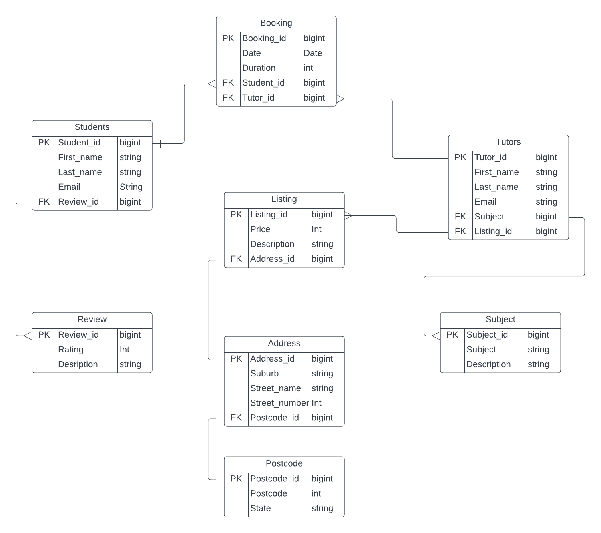

# T2A2-API-Webserver-Project

---

# Identification of the problem you are trying to solve by building this particular app.
Education is the most important foundation for a better life . My API aims to help students or learner to improve their understanding and skills they want to improve on. It range from helping students learn a language to helping them develop an understanding of programming. Recently during the Covid pendemic, learning has become difficult during these conditions. These made students fall behind on their work and stunts their potential growth for learning. The key challenge for student recently out of the Covid pendemic is the lack of foundational knowleddge they would have learned during the time of the pendemic, this hinders the progress of students and causes unneeded anxiety for their future prospects of their education. My API seeks to provide a service that allows the students to seek tutors from all kinds of places. These tutors can be exceptional students that can teach other students that have trouble with their learning, which makes this API flexible. Overall, this API seeks to provide help for struggling students that is struggling with their learning.


---

# Why is it a problem that needs solving?
In the recent years, there have been an education gap due to the geographic isolation, socio-economics and cultural background of the individual students. This has made the less privileged students behind on their learning. This problem has accelerated due to the Covid pendemic which has shown that students need support to keep up with their studies. By providing a tutor API service for students will help students that are underprivileged and behind to seek help. This API can even recruit exceptional students to become tutors to help more struggling students. This will overall decrease the education gap and make Australian more equal as a country.

---

# Why have you chosen this database system. What are the drawbacks compared to others?
I've chosen PostgreSQL as my chosen database system. PostgreSQL is a free and open source database system that provides reguarly updates and is very credible that many industry and organisation uses it. This ensures that the PostgreSQL database system is very secure. PostgreSQL can scale on projects really well. PostgreSQL supports JSON which is invulable to this API project. The commands for Postgresql is simple to use and is highly flexible and expandable for large databases.

However the drawbacks of PostgreSQL is has slow performance and reading speeds compared to other database management system. Many open source apps doesn't support PostgreSQL however support MySQL instead due it being more widely popular for developers.

Overall PostgreSQL is a great database management system that supports many features and updates on a reguarly bases however, there are other database management system that can perform the same amount of performance and better than PostgreSQL such as MySQL. 
---

# Identify and discuss the key functionalities and benefits of an ORM
ORM stands for Object-Relational-Mapper. The idea of ORM is that it can write queries such as this, ``` SELECT * FROM tutor WHERE name = 'Leo'; ``` to the database using the object-oritented paradigm of your preferred language. In this case, this would be Python. ORM can handle complicated queries using the same object-oriented paradigm. This lets the developer interact with the dataabase without using MySQL and write queries using a preferred language.

* Advantages - Advantages of using ORM
* * You can write on your preferred language if you aren't great in writing MySQL queries. This makes it easier for developers to focus of their projects and not worry aboout handling MySQL queries.
* * It is easy to switch to another database management system like transferring MySQL database to PostgreSQL database. It is due to it's abstract implementation and nature of ORM.
* * ORM supports many features that could be useful for a project. These features are support for transaction, connection pooling, migration seeds, streams and many more.
* * Queries written using ORM will perform better if you wrote them yourself and the developer will have a better understanding of the queries than writing it in MySQL database queries.


* Disadvantages - Disadvantages of using ORM
* * If you are proficient at writing queries, then you'd probably perfer writing in queries, than use the ORM.
* * The configuration for ORM can be confusing and frustrating to setup. This also makes it harder to become proficient at using it in the beginning.
* * As a developer, ORM is designed to avoid writing queries, this could weaken a developer skillset to write queries which could make you a weaker and more undesireable developer.
* * There is a steep learning curve for learning ORM.

In conclusion, ORM is great for developing projects without dealing with queries, which can be beneficial for new developers and provides a wide arrange of features with it. However, the downside of using ORM is that it could make you into a weaker developer since it avoid dealing with queries and has a steep learning curve.
---

# Document all endpoints for your API

---

# An ERD for your app


---

# Detail any third party services that your app will use
* Flask : Blueprint, Jsonify, Request

    * Blueprint - Defines the URL property and paths the controller to the desired path
    * Jsonify - Serializes the data into a JSON representation and changes it into a response object
    * Request - It request data from outside the function and returns it with the appropriate data  properties.

* Flask : JWT Extended

    * Create access token - Create a token for authentication and authorization that allows speical access to specific features of the API. These authentication and authorization parameters can be customized.
    * JWT manager - JWT manager stores and retireves tokens. This make it easier to manage the tokens
    * JWT required - It checks if you have a authentication token. If you have one, it will allow access to the site and its features, if the user doesn't have the token, it will block the user from access.
    * JWT Identity - A authentication that checks the identity of the token to see if it can validate the token user for access to the site.

* Marshmallow - It is used to create schema and validate the data from the API.

* Bcrypt - A encryption package that encrypts the data through a hashing process. This is normally used for password hashing.

* SQLAlchemy - It makes a connection to the databse and the Application (API)

* Psycopg2 - A database adapter for Python that creates a connection in flask.
---

# Describe your projects models in terms of the relationships they have with each other


## Students

### `has_many: bookings`
The student can make one or many bookings for tutors. Students can even has mutiple tutors. The model of students has the `has_many` association with `bookings`

### `has_many: review`
The review can make one or more reviews about the tutor from an individual student or mutiple students. The model of review has the `has_many` association with `review`

---

## Review
### `belongs_to: student`
The review can only belong to one student. The model of the review has the `belongs_to` association with `student`.

---

## Bookings

### `belongs_to: student`
A booking is booked for one student and one tutors. Therefore the model of the booking has the `belongs_to` association with `student`.

### `belongs_to: tutors`
A booking is booked for one tutors and one student. Therefore the model of the booking has the `belongs_to` association with `tutor`.

---

## Tutor 

### `has_many : subject `
A tutor can teach many subjects. Therefore the model of the Tutor has the `has_many` association with `subjects`.

### `has_many : listing `
A tutor can post many listing for his/her tutoring job. Therefore the has the `has_many` association with `listing`.

---

## Subject

### `belongs_to : Tutor`
A subject can be taught by a tutor, therefore the model of the Subject has the `belongs_to` association with `Tutor`.

---

## Listing

### `belongs_to : addresses`
There can only be one address for an individual tutor, therefore the model of the Listing has the `belongs_to` association with `Addresses`.

### `belongs_to : Tutor`
Each listing only has one tutor. Therefore the model of the Listing has the `belongs_to` association with `Tutor`.

---

## Address 

### `belongs_to : listing`
There can only be one address for listing on the tutoring job. Therefore the model of the Address has the `belongs_to` association with `listing`


### `belongs_to : postcode`
There can only be one postcode for one address. Therefore the model for the Address has the `belongs_to` association with `postcode`.

---

## postcode

### `belongs_to : Address`
There can only be one address for one postcode. Therefore the model for the postcode has the `belongs_to` association with `Address`


---

# Discuss the database relations to be implemented in your application

---

## Students

The `student` has a `one to many` relationship with both the `review` and the `booking`. This is due to the student can give one or many `reviews` of the tutor.  The `student` can book many tutor for its `booking`, therefore becoming a `one to many` relationship with both the `review` and the `booking`.

---

## Review

The `review` has a `many to one` relationship with the `student`. There could be mutiple `reviews`, however all those reviews belong to one `student`. Thus becoming a `many to one` relationship with the `student`

---

## Booking 

The `booking` has a `many to one` relationship with the `student` and the `tutor`. There are many bookings from the `student`, and many bookings from the `tutor`. Therefore the booking becoming a `many to one` relationship with both the `tutor` and the `student`.

---

## Tutor

The `tutor` has a `one to many` relationship with the `subject`. This is due to the tutor being able to teach mutiple subjects at one. The `tutor` has a `one to many` relationship with the `listing` due to the tutor being able to list their job mutiple time. Therefore `tutor` has a `one to many` relationship with both the `listing` and the `subject`.

---

## Subject

The `subject` has a `many to one` relationship with the `Tutor`. This is due to mutiple `subject` being able to be taught by one individual tutor. For example a `tutor` can both teach math and english. Therefore the `subject` has a `many to one` relationship with the `tutor`.

---

## Address

The `address` has a `one to one` relationship with the `listing` and the `postcode`. There can only be one `address` in one listing. There can only be one `postcode` in one `address`. Therefore the `address` has a `one to one` relationship with the `listing` and the `postcode`.

---

## Postcode

The `postcode` has a `one to one` relationship with the `address`. Since there coould only be one `postcode` in one `address`. Therefore the `postcode` has a `one to one` relationship with the `address`.

---

# Describe the way tasks are allocated and tracked in your project

